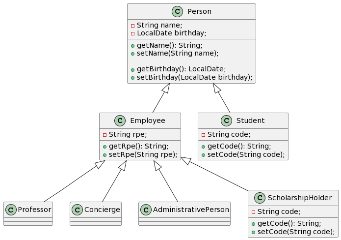

# Parcial2-Tarea1-Herencia

  Herencia multiple: la herencia multiple es cuando una clase puede heredar comportamientos de más de una clase distinta.

  Java no soporta la herenica multiple por la redundacia que se podria generar ambiguedad o conflicto entre los nombres, por ejemplo si una clase hereda metodos con nombres iguales
  el compilador no podria definir a cual se hace referencia.

